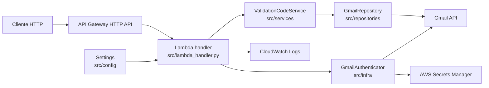
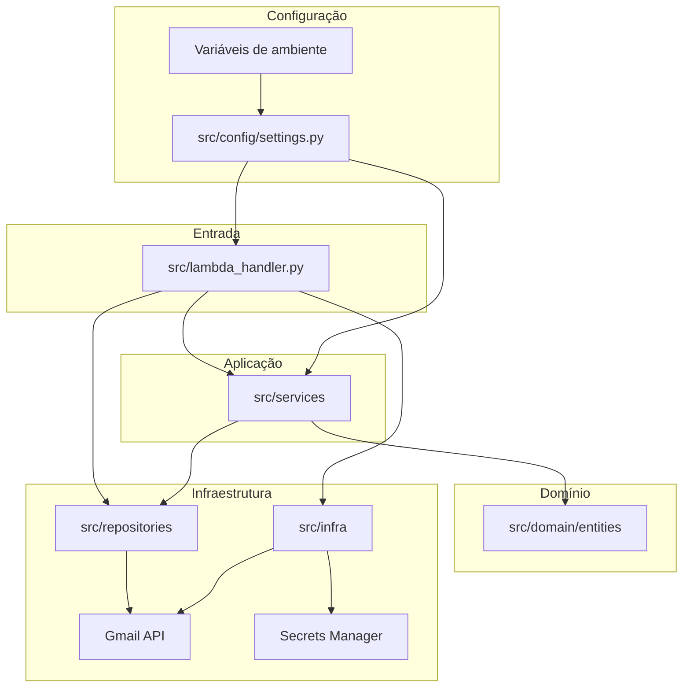
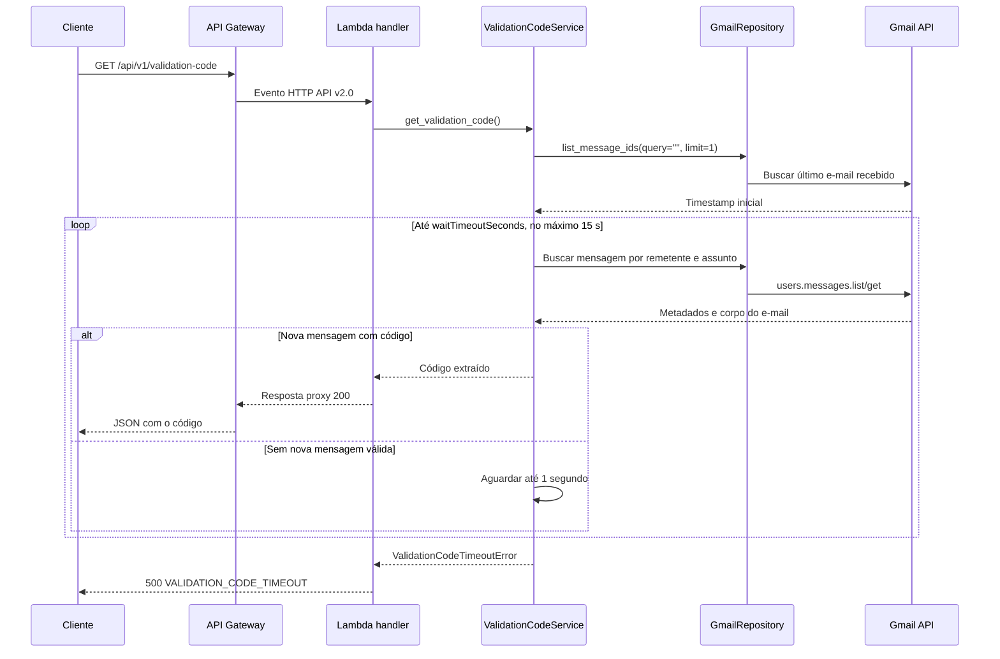

# Gmail Reader AWS

API serverless em Python 3.12 para monitorar uma conta Gmail via Gmail API e
extrair automaticamente códigos de validação recebidos por e-mail. A entrada
HTTP é tratada diretamente por uma função AWS Lambda integrada ao Amazon API
Gateway HTTP API.

No desenvolvimento local, o fluxo OAuth2 do Google pode abrir o navegador na
primeira execução e salvar o token em `GmailAPI/token.json`. Na AWS, o token é
lido do AWS Secrets Manager e o login interativo nunca é iniciado.

## Sumário

- [Sobre o projeto](#sobre-o-projeto)
- [Stack](#stack)
- [Arquitetura](#arquitetura)
- [Fluxo de funcionamento](#fluxo-de-funcionamento)
- [Estrutura do projeto](#estrutura-do-projeto)
- [Configuração](#configuração)
- [Execução local](#execução-local)
- [Contrato da API](#contrato-da-api)
- [Logging](#logging)
- [Testes](#testes)
- [Build e deploy](#build-e-deploy)
- [Observações operacionais](#observações-operacionais)

## Sobre o projeto

| Item | Descrição |
| --- | --- |
| Nome | `gmail-reader-aws` |
| Tipo | API REST serverless |
| Objetivo | Aguardar um novo e-mail de validação e retornar o código numérico encontrado |
| Linguagem | Python 3.12+ |
| Entrada HTTP | API Gateway HTTP API payload v2.0 |
| Computação | AWS Lambda com handler nativo |
| Integração externa | Gmail API com OAuth2 |
| Segredo em produção | AWS Secrets Manager |
| Infraestrutura | AWS SAM e CloudFormation |

Funcionalidades principais:

- autenticar na Gmail API usando OAuth2;
- registrar o timestamp do último e-mail recebido no início da chamada;
- aguardar uma nova mensagem que corresponda ao remetente e assunto configurados;
- extrair o código por expressão regular configurável;
- limitar a espera total a 15 segundos;
- retornar respostas proxy e erros padronizados em português do Brasil;
- reutilizar o cliente Gmail em invocações Lambda no mesmo ambiente;
- manter tokens, conteúdo de e-mail e códigos fora dos logs.

O projeto não usa FastAPI, Mangum, Uvicorn ou outro servidor ASGI. Também não
oferece Swagger UI, ReDoc ou documento OpenAPI.

## Stack

| Tecnologia | Uso |
| --- | --- |
| Python 3.12 | Runtime da aplicação e da Lambda |
| AWS Lambda | Execução do handler HTTP nativo |
| Amazon API Gateway HTTP API | Endpoint HTTPS e integração payload v2.0 |
| AWS Secrets Manager | Armazenamento do token OAuth2 na AWS |
| AWS SAM / CloudFormation | Infraestrutura, build e deploy |
| Amazon CloudWatch Logs | Logs com retenção de 14 dias |
| AWS X-Ray | Rastreamento da função |
| Google API Python Client | Acesso à Gmail API |
| Google Auth OAuthlib | Login local e renovação do token |
| python-dotenv | Configuração local por `.env` |
| Pytest / pytest-cov | Testes unitários e cobertura |

## Arquitetura

O projeto separa a entrada HTTP, a regra de negócio, o acesso ao Gmail, a
autenticação e a configuração.





Responsabilidades principais:

| Camada | Responsabilidade |
| --- | --- |
| `lambda_handler.py` | Validar evento HTTP, criar dependências e formatar respostas proxy |
| `services` | Aguardar novas mensagens e extrair o código |
| `repositories` | Consultar mensagens e metadados pela Gmail API |
| `infra` | Autenticar via OAuth2 e configurar logging |
| `config` | Carregar e validar configurações do ambiente |
| `domain` | Representar entidades puras do domínio |

## Fluxo de funcionamento



## Estrutura do projeto

```text
gmail-reader-aws/
|-- GmailAPI/                         # Credenciais e token OAuth locais; ignorado pelo Git
|-- docs/
|   |-- AWS_SAM_MIGRATION_STEP_BY_STEP.md
|   `-- env.local.example.json
|-- src/
|   |-- config/                       # Settings carregadas do ambiente
|   |-- domain/                       # Entidades de domínio
|   |   `-- entities/
|   |-- infra/                        # OAuth2 Gmail e logging
|   |-- repositories/                 # Acesso à Gmail API
|   |-- services/                     # Busca e extração do código
|   |-- lambda_handler.py             # Handler Lambda nativo
|   `-- requirements.txt              # Dependências de runtime e do build SAM
|-- tests/                            # Testes unitários
|-- .env.example                     # Exemplo para autenticação local
|-- env.local.example.json           # Variáveis para `sam local`
|-- GMAIL_API_SETUP.md               # Configuração do Google Cloud e OAuth2
|-- pyproject.toml                   # Pacote e dependências de desenvolvimento
|-- samconfig.local.toml             # Configuração SAM versionável
`-- template.yaml                    # Infraestrutura SAM
```

## Configuração

### Gmail API e OAuth2 local

Siga [GMAIL_API_SETUP.md](GMAIL_API_SETUP.md) para ativar a Gmail API, criar um
cliente OAuth2 do tipo aplicativo para computador e gerar
`GmailAPI/token.json`.

Crie o arquivo local de variáveis de ambiente:

```powershell
Copy-Item .env.example .env
```

| Variável | Obrigatória | Padrão | Descrição |
| --- | --- | --- | --- |
| `GMAIL_OAUTH_SECRET_ARN` | Na AWS | Ausente | ARN do segredo que contém o token OAuth2 |
| `SENDER_EMAIL` | Não | `logincaixa@caixa.gov.br` | Remetente esperado |
| `SUBJECT_FILTER` | Não | `Código de Validação` | Texto esperado no assunto |
| `ACTIVATION_CODE_REGEX` | Não | `Código de ativação: \d+` | Expressão usada para extrair o código |
| `WAIT_TIMEOUT_SECONDS` | Não | `15` | Espera entre 0 e 15 segundos |
| `CREDENTIALS_FILE` | Somente no primeiro login local | `GmailAPI/credentials.json` | Cliente OAuth2 baixado do Google Cloud |
| `TOKEN_FILE` | No modo local | `GmailAPI/token.json` | Token OAuth2 local |

Na AWS, `GMAIL_OAUTH_SECRET_ARN` tem precedência sobre os arquivos locais. O
segredo deve conter o JSON completo do token, incluindo `refresh_token`,
`client_id`, `client_secret`, `token_uri` e `scopes`.

Nunca versione `.env`, `env.local.json`, `samconfig.toml`, `GmailAPI/credentials.json`
ou `GmailAPI/token.json`.

### AWS SAM

Crie a configuração pessoal a partir da configuração-base:

```powershell
Copy-Item samconfig.local.toml samconfig.toml
```

Edite `samconfig.toml` e substitua `<perfil-aws-local>` e `<arn-do-segredo>`.
Esse arquivo é ignorado pelo Git.

## Execução local

### Preparar o ambiente Python

```powershell
python -m venv .venv
.\.venv\Scripts\Activate.ps1
python -m pip install -e ".[dev]"
```

`src/requirements.txt` é a fonte única das dependências de runtime. O
`pyproject.toml` reutiliza esse arquivo para a instalação local e o SAM o usa
para montar o pacote da Lambda.

### Gerar ou validar o token OAuth2

```powershell
$env:PYTHONPATH = "src"
python -c "from config import Settings; from infra import GmailAuthenticator; GmailAuthenticator(Settings()).authenticate()"
```

### Executar com SAM local

O Docker Desktop deve estar em execução. Copie o exemplo e informe um ARN real:

```powershell
$AwsProfile = "<perfil-aws-local>"
$AwsRegion = "us-east-1"
Copy-Item env.local.example.json env.local.json
sam build --use-container
sam local start-api --env-vars env.local.json --profile $AwsProfile --region $AwsRegion
```

Endpoint local:

```text
http://127.0.0.1:3000/api/v1/validation-code
```

## Contrato da API

### Endpoint

| Método | Endpoint | Descrição |
| --- | --- | --- |
| `GET` | `/api/v1/validation-code` | Aguarda uma nova mensagem e retorna o código extraído |

Outros métodos e caminhos retornam `404 NOT_FOUND`. Não existem endpoints de
documentação ou esquema OpenAPI.

### Query string

```http
GET /api/v1/validation-code?waitTimeoutSeconds=3
```

| Parâmetro | Tipo | Obrigatório | Descrição |
| --- | --- | --- | --- |
| `waitTimeoutSeconds` | Inteiro de `0` a `15` | Não | Sobrescreve `WAIT_TIMEOUT_SECONDS` somente nesta chamada |

### Resposta de sucesso

Status HTTP `200`:

```json
{
  "code": "123456",
  "message": "Código de validação encontrado com sucesso."
}
```

### Respostas de erro

Todos os erros usam o envelope:

```json
{
  "error": {
    "code": "INVALID_WAIT_TIMEOUT_SECONDS",
    "message": "waitTimeoutSeconds deve ser um inteiro entre 0 e 15."
  }
}
```

| Status | Código | Situação |
| --- | --- | --- |
| `400` | `INVALID_WAIT_TIMEOUT_SECONDS` | Timeout fora do intervalo aceito ou não inteiro |
| `404` | `NOT_FOUND` | Método ou caminho não suportado |
| `500` | `VALIDATION_CODE_TIMEOUT` | Nenhuma mensagem válida chegou no prazo |
| `500` | `AUTHENTICATION_ERROR` | Falha ao autenticar na Gmail API |
| `500` | `GMAIL_API_CONNECTION_ERROR` | Falha temporária de conexão ou TLS |

O `body` retornado pelo handler é sempre uma string JSON, conforme o contrato de
integração proxy do API Gateway HTTP API.

## Logging

Os módulos usam o `logging` da biblioteca padrão. O utilitário de configuração
local está em `src/infra/logger.py`; na AWS, a saída do runtime é capturada e
enviada ao CloudWatch Logs.

Formato local:

```text
YYYY-MM-DD HH:MM:SS | LEVEL    | modulo | mensagem
```

A aplicação registra o timestamp inicial, as tentativas de busca, o tempo
restante e o resultado da operação. Tokens OAuth2, corpos de e-mail e o valor do
código de validação não devem aparecer nos logs.

O template define retenção de 14 dias e ativa o X-Ray para a função.

## Testes

Execute a suíte com cobertura:

```powershell
.\.venv\Scripts\python.exe -m pytest --cov=src --cov-report=term-missing -q
```

Ou, com o ambiente virtual ativo:

```powershell
python -m pytest --cov=src --cov-report=term-missing -q
```

Regras dos testes:

- não acessar Gmail ou AWS reais;
- usar mocks para mensagens, autenticação e Secrets Manager;
- cobrir o handler HTTP nativo e os limites de timeout;
- garantir que informações sensíveis não sejam registradas;
- manter a cobertura mínima configurada em 100%.

## Build e deploy

Valide e construa o pacote em contêiner para evitar artefatos incompatíveis do
Windows:

```powershell
sam validate --lint
sam build --use-container
```

No primeiro deploy, use o modo guiado ou preencha `samconfig.toml`:

```powershell
$AwsProfile = "<perfil-aws-local>"
$AwsRegion = "us-east-1"
$OAuthSecretArn = "<arn-do-segredo>"

sam deploy --guided `
  --stack-name gmail-reader `
  --region $AwsRegion `
  --profile $AwsProfile `
  --capabilities CAPABILITY_IAM `
  --parameter-overrides GmailOAuthSecretArn=$OAuthSecretArn
```

O roteiro completo de migração, validação, deploy, segurança e rollback está em
[docs/AWS_SAM_MIGRATION_STEP_BY_STEP.md](docs/AWS_SAM_MIGRATION_STEP_BY_STEP.md).

## Observações operacionais

- A API usa somente o escopo `https://www.googleapis.com/auth/gmail.readonly`.
- A chamada registra o último e-mail existente antes de aguardar mensagens novas.
- A requisição pode sobrescrever apenas `waitTimeoutSeconds`.
- O timeout da Lambda é 25 segundos e o orçamento de espera é limitado a 15.
- O cliente Gmail é reaproveitado no mesmo ambiente de execução da Lambda.
- O segredo OAuth é criado fora da stack e não é removido por `sam delete`.
- O endpoint do template ainda não possui authorizer e serve apenas para smoke
  tests controlados.
- Antes da produção, configure autenticação, throttling, concorrência reservada,
  alarmes e orçamento AWS.
- Para trocar a conta local, remova `GmailAPI/token.json` e repita o login.
- Se o token na AWS for revogado, gere-o localmente e publique uma nova versão no
  Secrets Manager.
